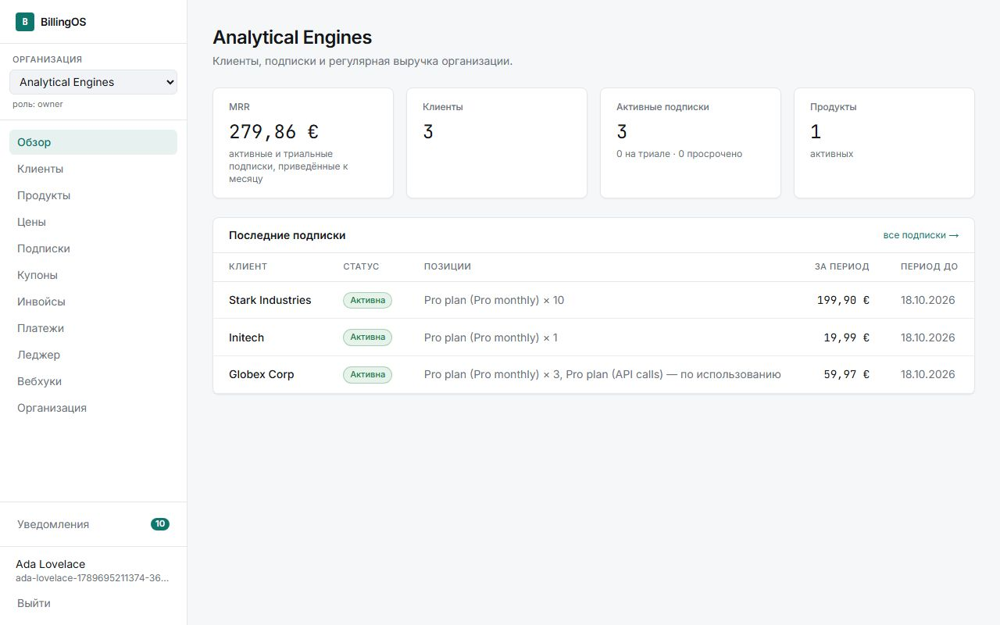
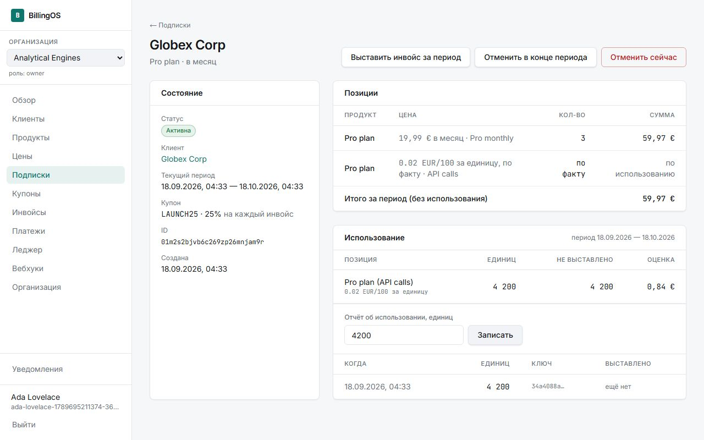
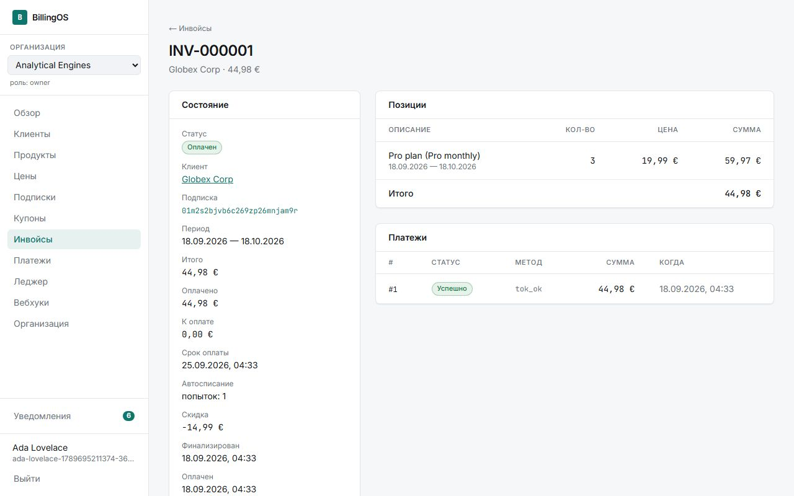
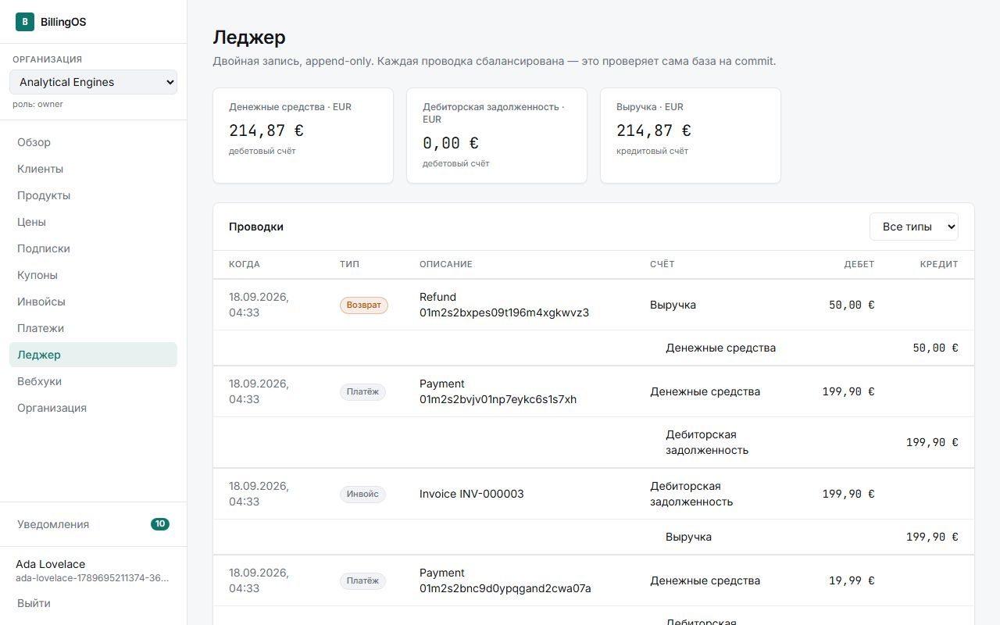
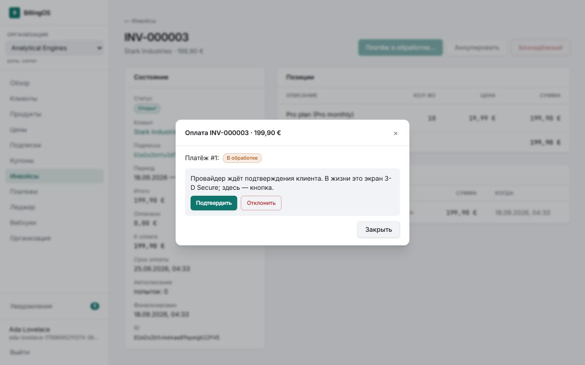
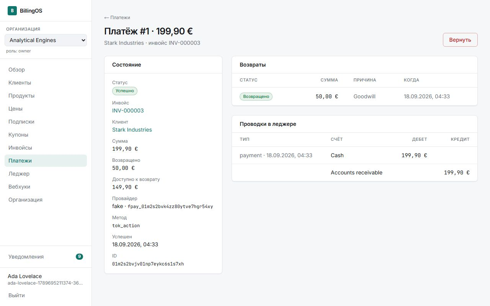
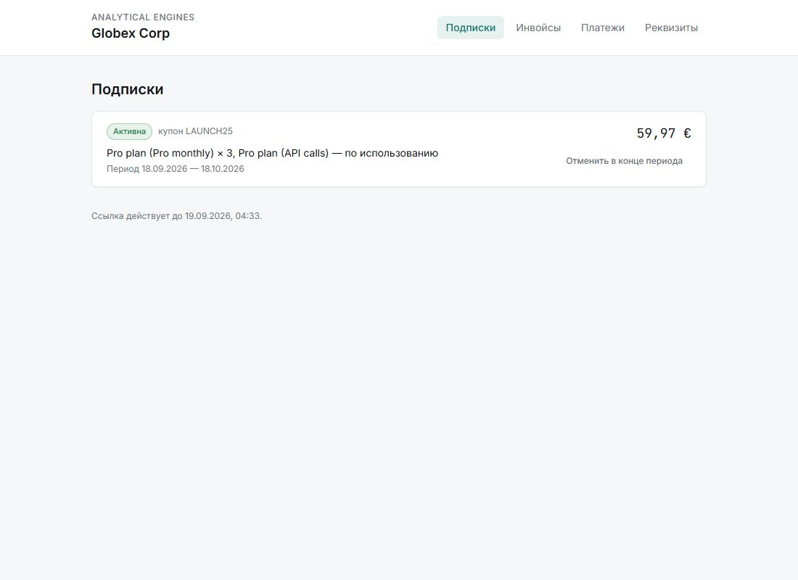
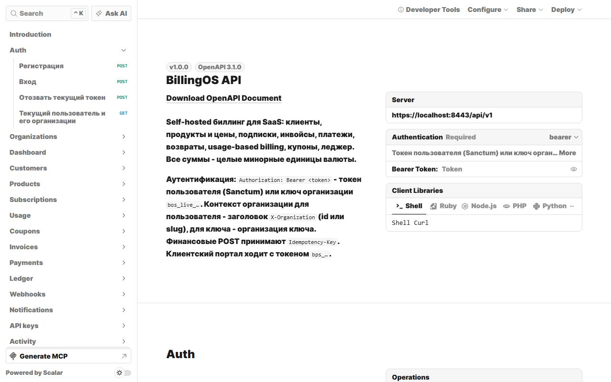
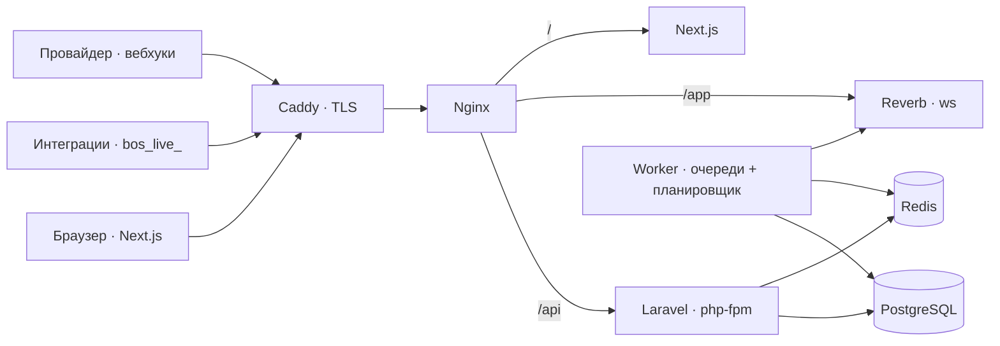

# BillingOS

Self-hosted биллинг и подписки для SaaS: клиенты, продукты и цены, подписки с триалами, инвойсы, платежи и возвраты, usage-based тарифы, купоны, клиентский портал, API-ключи и проверяемый финансовый леджер. Один `docker compose up` - и всё работает у вас.

Проект строится вокруг одного правила:

> **Любая операция с деньгами должна быть безопасна при повторе.** Запрос, job или вебхук могут прийти дважды - финансовый эффект от этого не удваивается.

Это не CRUD вокруг таблицы `invoices`, а разбор того, как деньги живут в системе: целые минорные единицы вместо float, state machine со списком переходов, идемпотентность на входе, двойная запись на выходе и PostgreSQL, который сам не даст записать несбалансированную проводку или поменять сумму финализированного инвойса.

| | |
|---|---|
|  |  |
|  |  |
|  |  |
|  |  |

Ещё: [продукты и цены](docs/screenshots/products.jpg), [инвойсы](docs/screenshots/invoices.jpg), [вебхуки](docs/screenshots/webhooks.jpg), [уведомления](docs/screenshots/notifications.jpg), [API-ключи](docs/screenshots/settings.jpg), [инвойс в портале](docs/screenshots/portal-invoice.jpg).

## Стек

**Backend** - PHP 8.4, Laravel 13, PostgreSQL 16, Redis 7, Sanctum, очереди, Reverb. Pest (108 тестов), PHPStan level 5 (larastan), Pint.
**Frontend** - TypeScript, Next.js 16 (App Router), Tailwind 4, TanStack Query, laravel-echo. Vitest, Playwright.
**Инфраструктура** - Docker Compose для разработки и production, nginx, Caddy с автоматическим TLS, GitHub Actions, k6, Sentry, Prometheus-метрики.

## Архитектура



Монолит на Laravel с тонкими контроллерами и сервисами, которые открывают транзакции сами и знают, где вызов провайдера обязан быть вне транзакции. Один PHP-образ работает как `app`, `worker` и `websocket`. Фронтенд - клиент API без серверной логики. Подробно - в [docs/architecture.md](docs/architecture.md): слои, схема данных, фоновые процессы, realtime.

## Как устроен биллинг

```text
создание ──(триал)──► trialing ──► конец триала ─┐
    │                                             ▼
    └──► инвойс за первый период ──► автосписание ──► active ──► продление каждый период
                                         │ отказ                      │ usage за прошедший период
                                         ▼                             ▼
                              incomplete / past_due ──► ретраи +1д / +3д / +7д ──► canceled
```

- **Деньги.** Никаких float: `19.99 EUR` = `Money(1999, 'EUR')`, экспонента валюты из конфига, арифметика между валютами запрещена типом, проценты округляются half-up в минорных единицах, metered-цены (`0.1` = €0.001 за запрос) считаются bcmath и округляются один раз на строку инвойса.
- **Подписки.** Позиции `цена × количество`, один интервал и одна валюта на подписку, период без переполнения месяца (31 января + месяц = 28 февраля). Цены неизменяемы: под них уже оформлены подписки. `canceled` терминален - продлить отменённую нельзя ни рукой, ни job'ой.
- **Инвойсы.** `draft → open → paid`, из `open` ещё `void` и `uncollectible`. Финализация выдаёт сквозной `INV-000001` атомарным `UPDATE … RETURNING` и замораживает документ триггером PostgreSQL. Нулевой инвойс сразу `paid`.
- **Продление и dunning.** `subscriptions:renew` каждую минуту; период сдвигается одним `UPDATE … WHERE current_period_end = :expected`, поэтому повтор job ничего не сдвинет. Неудачное автосписание планирует попытки по `[1, 3, 7]` дней, потом `canceled` с причиной `payment_failed`.
- **Usage и купоны.** Отчёты `POST /usage` с `idempotency_key` дедуплицируются индексом, выставляются при продлении за прошедший период. Купоны процентные и фиксированные, `once`/`forever`, лимит списывается `UPDATE … WHERE times_redeemed < max` под lock.
- **Леджер.** Четыре счёта на валюту: `cash`, `receivable`, `revenue`, `adjustments`. Инвойс - `receivable/revenue`, платёж - `cash/receivable`, возврат - `revenue/cash`, списание - `adjustments/receivable`. Проводки только добавляются, баланс проверяет отложенный constraint базы, каждое событие проводится один раз.

## Платёж и идемпотентность

```text
POST /payments {invoice_id, payment_method}      Idempotency-Key: …
   │
   ├─ middleware: ключ занят другим телом → 409, в полёте → 409, уже отвечали → тот же ответ + Idempotent-Replayed
   ├─ транзакция 1: lock инвойса, проверка статуса и остатка, попытка pending
   │                (частичный уникальный индекс: один платёж «в полёте» на инвойс)
   ├─ вызов провайдера ВНЕ транзакции
   └─ транзакция 2: lock платежа, атомарный переход статуса, проводка, инвойс paid
```

Результат провайдера может прийти синхронно, вебхуком или и так и так - `applyResult` применяет терминальный статус ровно один раз. Вебхук принимается только с HMAC-SHA256 подписью секретом организации и свежим timestamp, дубликат события отбрасывается уникальным индексом, обработка идёт в очереди. Возврат - компенсирующая операция: платёж не меняется, растёт `amount_refunded`, `CHECK` не даст вернуть больше списанного.

Провайдер спрятан за `PaymentProvider`; в комплекте `FakeProvider`, у которого исход задаёт платёжный метод: `tok_ok`, `tok_fail`, `tok_insufficient`, `tok_async` (успех придёт вебхуком - воркер честно стучится по HTTP в наш же эндпоинт), `tok_action` (аналог 3-D Secure с подтверждением), `tok_error`.

## Схема данных

```mermaid
erDiagram
    organizations ||--o{ customers : ""
    organizations ||--o{ products : ""
    products ||--o{ prices : ""
    customers ||--o{ subscriptions : ""
    subscriptions ||--o{ subscription_items : ""
    subscription_items ||--o{ usage_events : ""
    subscriptions ||--o{ invoices : ""
    invoices ||--o{ invoice_items : ""
    invoices ||--o{ payments : ""
    payments ||--o{ refunds : ""
    ledger_transactions ||--|{ ledger_entries : ""
    ledger_accounts ||--o{ ledger_entries : ""
    organizations ||--o{ webhook_events : ""
    organizations ||--o{ idempotency_keys : ""
    organizations ||--o{ api_keys : ""
    organizations ||--o{ activity_logs : ""
```



Полная схема с полями и ограничениями - в [docs/architecture.md](docs/architecture.md#схема-данных).

## Безопасность

- Организации изолированы на уровне биндинга маршрутов: чужой id - 404, а не 403. Роли `owner > admin > developer > viewer` в политиках каждой модели; API-ключ всегда `developer`, портал - только свой клиент.
- Идемпотентность, один платёж в полёте, подписанные вебхуки, заморозка инвойсов и append-only леджер держатся базой, а не только кодом.
- Пароли bcrypt, lockout после 5 неудач; API-ключи и токены портала хранятся хешами; секреты вебхуков зашифрованы; именованные rate limit'ы с отдельными счётчиками.
- `CSP default-src 'none'`, HSTS за TLS, `X-Frame-Options: DENY`; аутентификация без cookie, поэтому CSRF не применим; JSON-404 без имён классов; `/metrics` за токеном.
- Append-only журнал действий с актором (пользователь, ключ, клиент портала, система) и ip.
- В CI - `composer audit` и `npm audit`; в production - контейнеры не от root, без `.env` и dev-зависимостей.

Модель угроз с привязкой каждого контроля к тесту - [docs/security.md](docs/security.md).

## Проверки и результаты

| Что | Как | Результат |
|---|---|---|
| Backend | `php artisan test` (Pest) | 108 тестов, 897 проверок, ~50 с |
| Статика | PHPStan level 5, Pint | чисто |
| Frontend | `npm run lint && npm run typecheck && npm run test:unit` | чисто, 5 unit-тестов денег |
| E2E | Playwright, 4 спека × 7 тестов через живой стек | 7 passed, ~55 с; в CI - через production-стек за Caddy и TLS |
| Нагрузка | k6, `bench/api.js` | ~83 rps смешанной нагрузки при p95 104 мс на чтение и 217 мс на подписку с автосписанием, 0 ошибок; потолок 20 воркеров ~137 rps |

Что покрывает E2E: регистрация → продукт → клиент → подписка → инвойс → асинхронный платёж → вебхук → инвойс оплачен → леджер сходится; автосписание с купоном и usage; отказ карты и повторная попытка; `requires_action` с подтверждением, вебхуком и частичным возвратом; черновик с произвольной позицией, оплаченный из портала; изоляция организаций в UI и API; повтор `Idempotency-Key` не списывает дважды.

Бэкенд-тесты держат то, что не видно снаружи: заморозку инвойса и append-only леджер на уровне базы, несбалансированную проводку, отклонённую на commit, replay старой подписи вебхука, ключи идемпотентности per-organization, dunning по расписанию, продление без двойного инвойса, дедуп usage и уведомлений, роли по всем ресурсам. Полные цифры нагрузки и что под ней нашлось - [docs/benchmarks.md](docs/benchmarks.md).

```bash
docker compose exec app php artisan test
docker compose exec app vendor/bin/phpstan analyse --memory-limit=1G
docker compose exec app vendor/bin/pint --test
cd frontend && npm run lint && npm run typecheck && npm run test:unit
cd frontend && npm run test:e2e            # стек должен быть поднят; BOS_URL для другого адреса
cd frontend && npm run screenshots         # docs/screenshots/*.jpg
```

## Запуск для разработки

```bash
cp .env.example .env            # порты на хосте; по умолчанию 8090 / 3001 / 5434 / 6382
docker compose up -d --build
```

- приложение: http://localhost:8090
- API: http://localhost:8090/api/v1, документация: http://localhost:8090/api/docs
- Mailpit: http://localhost:8027

`app` при первом старте ставит зависимости, генерирует `APP_KEY` и накатывает миграции; `worker` ждёт, пока `app` станет healthy. Код смонтирован с хоста, фронтенд - `next dev`.

## Production

```bash
cp .env.prod.example .env.prod   # домен, APP_KEY, пароли, SMTP
docker compose --env-file .env.prod -f docker-compose.prod.yml -p billingos-prod up -d --build --wait
```

Caddy получает сертификат Let's Encrypt и проксирует в nginx; образы многостадийные (223 МБ бэкенд с opcache+JIT и php-fpm static, Next standalone), без bind mount'ов, конфиг/маршруты/события кешируются на старте, контейнеры не от root, healthcheck'и и `restart: always`. Проверить стек локально можно без домена: `sh scripts/local-prod-env.sh` и та же команда. Обновление, бэкапы, наблюдение и масштабирование - [docs/deployment.md](docs/deployment.md).

Наблюдаемость: `/health/live`, `/health/ready`, `/health/deep` (очереди, планировщик, сокет, зависшие платежи), `/metrics` в формате Prometheus за токеном, Sentry по DSN на бэкенде и фронтенде.

## API

Спецификация OpenAPI 3.1 - [docs/openapi.yaml](docs/openapi.yaml), интерактивная документация - `GET /api/docs`. Тест `DocsTest` сверяет спецификацию с реальными маршрутами в обе стороны.

```text
POST   /api/v1/auth/register            POST /api/v1/auth/login   POST /api/v1/auth/logout   GET /api/v1/auth/me
GET    /api/v1/organizations            POST /api/v1/organizations   GET|PATCH …/{id}   …/members   …/transfer
GET    /api/v1/dashboard
GET    /api/v1/customers                POST /api/v1/customers      GET|PATCH|DELETE …/{id}   POST …/{id}/portal-session
GET    /api/v1/products                 POST /api/v1/products       GET|PATCH|DELETE …/{id}
GET    /api/v1/prices                   POST /api/v1/prices         GET|PATCH|DELETE …/{id}
GET    /api/v1/subscriptions            POST /api/v1/subscriptions  GET …/{id}   POST …/{id}/cancel|resume|invoice|coupon   GET …/{id}/usage
GET    /api/v1/usage                    POST /api/v1/usage
GET    /api/v1/coupons                  POST /api/v1/coupons        GET|PATCH …/{id}
GET    /api/v1/invoices                 POST /api/v1/invoices       GET|DELETE …/{id}   POST …/{id}/items   DELETE …/{id}/items/{item}
POST   /api/v1/invoices/{id}/finalize   POST …/{id}/void   POST …/{id}/uncollectible
GET    /api/v1/payments                 POST /api/v1/payments       GET …/{id}   POST …/{id}/refund   POST …/{id}/cancel   GET /api/v1/refunds
POST   /api/v1/providers/fake/payments/{providerPaymentId}/confirm
GET    /api/v1/ledger/accounts          GET /api/v1/ledger/transactions
POST   /api/v1/webhooks/{provider}      GET /api/v1/webhooks/events
GET    /api/v1/notifications            POST …/{id}/read   POST …/read-all   GET|PATCH …/preferences
GET    /api/v1/api-keys                 POST /api/v1/api-keys       DELETE …/{id}
GET    /api/v1/activity
GET    /api/v1/portal/session           PATCH …/billing   GET …/subscriptions   POST …/subscriptions/{id}/cancel
GET    /api/v1/portal/invoices          GET …/{id}   GET …/{id}/export?format=csv|json   POST …/{id}/pay   GET …/payments
POST   /api/broadcasting/auth           авторизация приватных каналов Reverb
```

Аутентификация - `Authorization: Bearer <token>` (Sanctum) или ключ организации `bos_live_…`, контекст - `X-Organization` (для ключа - организация ключа), идемпотентность - `Idempotency-Key`. Портал - `Authorization: Bearer bps_…`. Ошибки валидации - 422, нарушение доменных правил (недопустимый переход состояния, смешение валют, второй платёж в полёте) - 409.

## Структура

```text
backend/     Laravel: app/Billing (Money), app/Payments (провайдер), app/Services, app/Tenancy, app/Audit, app/Enums (state machines), tests/
frontend/    Next.js: src/app (страницы, /portal/[token]), src/components, src/services, src/lib; tests/unit, tests/e2e
docker/      php (dev и prod образы, entrypoint), nginx (dev и prod), caddy, postgres
docs/        architecture, security, deployment, benchmarks, openapi.yaml, screenshots
bench/       k6
scripts/     local-prod-env.sh
.github/     ci.yml (audit, pint, phpstan, pest, lint, typecheck, vitest, build, образы), e2e.yml (Playwright через production-стек)
```

## Что осталось за рамками

Налоги и НДС, мультирегион, реальные платёжные провайдеры (интерфейс есть, реализация одна - fake), бухгалтерская отчётность за пределами леджера, второй фактор. Проект закончен по своему определению готовности, и добавлять функции только потому, что есть место, не планируется.
