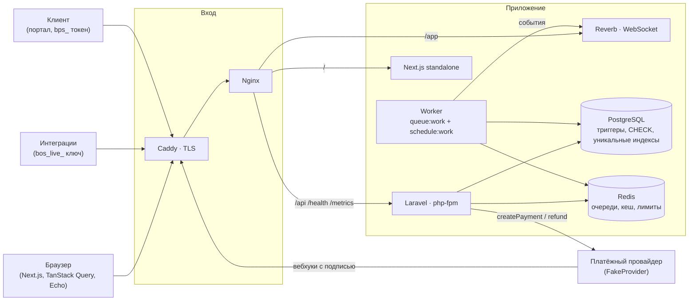
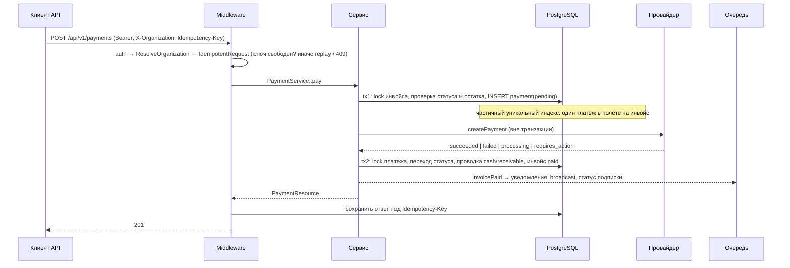
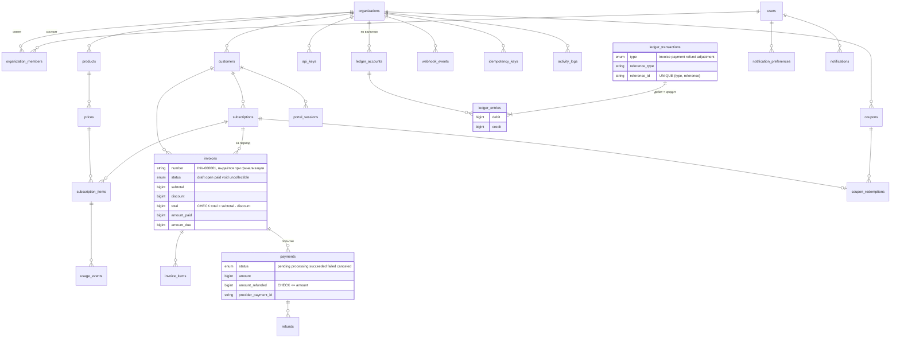

# Архитектура

BillingOS - монолит на Laravel с отдельным Next.js-фронтендом. Вся логика денег живёт в сервисах бэкенда и охраняется базой; фронтенд - тонкий клиент API.

## Компоненты



Один PHP-образ работает в трёх ролях (`CONTAINER_ROLE=app|worker|websocket`). Воркер обслуживает очереди `billing` и `default` и крутит планировщик; `/health/deep` следит, что он жив.

## Слои бэкенда

```text
app/Http        контроллеры (тонкие), FormRequest-валидация, ресурсы, middleware
app/Services    доменные операции: Subscription, Invoice, Payment, Refund, Ledger, Webhook, Collection, Usage, Coupon, Portal, ApiKey, Organization
app/Billing     Money, Currency, BillingInterval - value objects без float
app/Payments    контракт PaymentProvider, DTO, ProviderRegistry, FakeProvider
app/Enums       статусы как state machine: таблица переходов + атомарный UPDATE … WHERE status = :from
app/Tenancy     CurrentOrganization / CurrentCustomer - контекст запроса (scoped singleton)
app/Audit       Activity::record - журнал действий
app/Jobs        RenewSubscription, CollectInvoice, ProcessWebhookEvent, DeliverFakeWebhook
app/Listeners   реакции на доменные события: статус подписки, уведомления, broadcast
```

Контроллер проверяет политику, валидирует, зовёт сервис, отдаёт ресурс. Сервисы открывают транзакции сами и знают, где вызов провайдера должен быть *вне* транзакции. События (`InvoicePaid`, `PaymentFailed`, …) диспатчатся из сервисов; слушатели ставятся в очередь после commit.

## Запрос через систему



Если провайдер ответил `processing`, итог придёт вебхуком: `POST /webhooks/fake` проверяет подпись, сохраняет событие (дубликат по `event_id` - 200 и выход), а `ProcessWebhookEvent` в очереди применяет результат через тот же `applyResult` - терминальный статус ставится ровно один раз, откуда бы ни пришёл.

## Изоляция организаций

- Организация запроса резолвится один раз в `ResolveOrganization`: из `X-Organization` (id или slug), из единственного членства, или из API-ключа. Middleware стоит в списке приоритетов раньше `SubstituteBindings`, поэтому биндинги уже знают контекст.
- `BelongsToOrganization` даёт scope `forOrganization` и переопределяет `resolveRouteBinding`: модель ищется только в текущей организации. Чужой id даёт 404, а не 403 - существование ресурса не раскрывается.
- Политики наследуют `TenantPolicy`: `viewAny/view` - viewer, `create/update` - developer, `delete` - admin; финансовые действия уточняются в политиках моделей (возврат - admin, финализация - developer).
- Роль API-ключа всегда `developer`, портал вообще не имеет пользователя - только `CurrentCustomer`.

## Деньги и состояния

- `Money(int $amount, Currency $currency)`: минорные единицы, экспонента из `config/billing.php`, арифметика между валютами - исключение `CurrencyMismatch` (наружу 409). Проценты округляются half-up в минорных единицах, metered-цены считаются через bcmath и округляются один раз на строку инвойса.
- Статусы - enum'ы с таблицей переходов (`InvoiceStatus`, `PaymentStatus`, `SubscriptionStatus`, `RefundStatus`). Переход - `UPDATE … WHERE id = ? AND status = :from`; если строка не обновилась, переход уже сделал кто-то другой. Недопустимый переход - `InvalidTransition` (409).
- База держит инварианты сама: `invoices_guard` замораживает финализированный инвойс, `ledger_immutable` запрещает правку проводок, отложенный constraint `ledger_entries_balanced` не даст закоммитить несбалансированную проводку, `CHECK` на суммах и возвратах, частичные уникальные индексы на платёж в полёте и на `idempotency_key` usage-событий, `activity_logs_immutable` для журнала.

## Схема данных



Идентификаторы биллинговых сущностей - ULID (сортируются по времени, не перебираются), у пользователей и организаций - целые.

## Фоновые процессы

| Что | Когда | Идемпотентность |
|---|---|---|
| `subscriptions:renew` → `RenewSubscription` | каждую минуту | период сдвигается `WHERE current_period_end = :expected`; инвойс за период создаётся один раз |
| `invoices:collect` → `CollectInvoice` | каждую минуту, по `next_payment_attempt_at` | счётчик попыток и дата следующей фиксируются до вызова провайдера |
| `ProcessWebhookEvent` | по приёму вебхука, `ShouldBeUnique` | событие переводится `received → processing` атомарно; терминальный платёж не трогается |
| `DeliverFakeWebhook` | отложенно после `tok_async` / `confirm` | провайдер ретраит доставку при 5xx |
| `idempotency:prune`, `activity:prune` | раз в час / раз в сутки | удаление по сроку |

Все команды планировщика - `onOneServer()`, поэтому воркеров может быть несколько.

## Realtime и уведомления

Доменное событие → два слушателя после commit: `NotifyAboutBillingEvent` рассылает участникам от developer и выше (in-app с `dedupe_key`, почта, broadcast в `user.{id}` - по настройкам каждого), `BroadcastBillingEvent` кладёт лёгкий сигнал в `private-organization.{id}`. Фронтенд по сигналу инвалидирует запросы TanStack Query - данные не гоняются через сокет, только факт изменения. Авторизация каналов - `POST /api/broadcasting/auth` с тем же Bearer-токеном.

## Фронтенд

Next.js App Router, всё клиентское: `src/services/*` - тонкие обёртки над `fetch` с токеном из `localStorage` и `X-Organization`, `src/hooks/useRealtime` - подписка на Echo, `src/lib/money.ts` - форматирование и разбор сумм без float (покрыто Vitest). Портал клиента живёт в `src/app/portal/[token]` и ходит только в `/api/v1/portal/*`.

## Границы

Не входит в проект и не планируется: налоги и НДС, мультирегион, реальные провайдеры (интерфейс есть, реализация одна - fake), бухгалтерская отчётность за пределами леджера, пользовательские роли тоньше четырёх встроенных.
